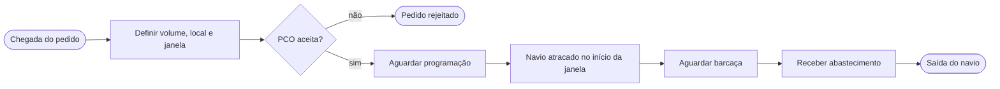
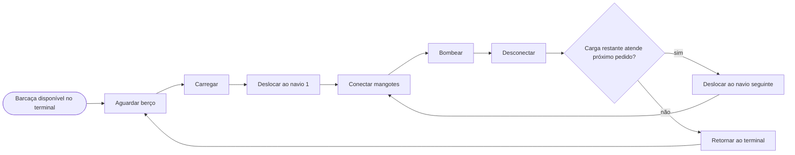
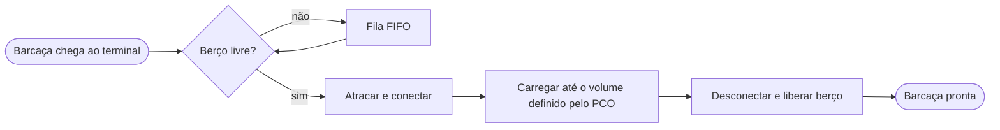
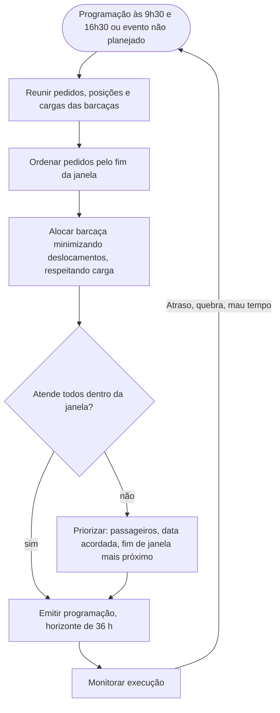

# Modelo Conceitual – Operação de Bunkering da BVE (Porto Mar Azul)

**Versão:** 1.0 (23/09/2026) · Grupo G102 · Documento vivo: evolui com os dados e a validação (ver registro de revisões ao final).

## 1. Propósito e fronteira

Representar a operação de abastecimento por barcaças para avaliar, por simulação de eventos discretos, alternativas que elevem a capacidade em 20% (ver `G102_Proposta.md`). O modelo responde aos indicadores da proposta: vazão atendida, percentual de atendimentos dentro da janela, atraso ponderado, espera do navio, utilização de berços e barcaças e filas.

**Dentro da fronteira:** chegada e demanda dos navios, terminal de carregamento (2 berços), frota de barcaças, deslocamento até os terminais do porto, bombeamento e coordenação (PCO).
**Fora da fronteira:** refinarias e reabastecimento dos tanques do terminal (assumido disponível), tráfego no canal, negociação comercial do pedido.

## 2. Entidades, recursos e regras-chave

| Elemento | Tipo | Atributos principais |
|----------|------|----------------------|
| Navio / pedido | Entidade | tipo, volume *a* (t), local de atracação *f*, janela [*d¹*, *d²*], prioridade (passageiro, data acordada) |
| Barcaça | Recurso móvel | capacidade (até 3.000 t), carga remanescente, vazão de bombeamento (200 t/h), velocidade (4,5 km/h), posição, estado |
| Berço de carregamento | Recurso | 2 unidades; vazão de carregamento; ocupado/livre |
| Terminais do porto | Locais | matriz de distâncias a partir do terminal BVE |
| PCO | Ator de decisão | regra de programação, horários, prioridades |

Estados da barcaça: aguardando berço, carregando, em deslocamento, aguardando janela/navio, conectando, bombeando, desconectando, retornando, indisponível.

## 3. Processo de demanda (navios)

- Os pedidos chegam segundo um processo estocástico (taxa por dia/hora, a estimar); volume, local e duração da janela seguem distribuições empíricas.
- O serviço só ocorre com o navio atracado; a janela [*d¹*, *d²*] limita o início e o fim do abastecimento.
- Se o abastecimento termina após *d²*, o atraso é *T = C − d²*, ponderado pela prioridade.
- Pedidos com volume acima da capacidade da barcaça são atendidos por mais de uma barcaça (a confirmar).

## 4. Processo de abastecimento (barcaças)

Tempo de serviço por pedido (calibrado em Costa e Mesquita, 2023):
**p = tᵢ + a / vazão + t_f**, com tᵢ (atracação, documentação, conexão, inspeção; média inicial de 1,5 h) e t_f (medição, desconexão; média inicial de 1,5 h). Tempo de deslocamento = distância / velocidade. Uma barcaça pode atender vários navios por viagem, enquanto sua carga remanescente cobrir o pedido seguinte.

## 5. Processo de carregamento (terminal BVE)

- Recurso limitado: 2 berços (parâmetro de cenário). Carregar 3.000 t a 200 t/h leva cerca de 15 h; a vazão real de terminal e por berço será confirmada com o cliente.
- Volume carregado: definido pelo PCO conforme os pedidos programados, até a capacidade da barcaça.
- Pode haver tempo de setup, paradas por manutenção e limite de estoque do tanque (a confirmar).

## 6. Coordenação da operação (PCO)

O PCO é modelado como regra de decisão: no cenário-base, a regra manual descrita em Costa e Mesquita (2023); nos demais cenários, regras alternativas (por exemplo, prioridade por atraso esperado e por barcaça mais próxima).

## 7. Eventos e interações entre processos

| Evento | Processo que dispara | Efeito |
|--------|----------------------|--------|
| Chegada de pedido | Demanda | entra na fila do PCO |
| Programação (2×/dia) | PCO | atribui pedidos a barcaças e define o carregamento |
| Fim de carregamento | Carregamento | libera berço, barcaça parte |
| Fim de bombeamento | Abastecimento | libera navio, atualiza carga remanescente |
| Perturbação (atraso, quebra) | PCO / exógeno | dispara reprogramação |

## 8. Hipóteses e simplificações

1. Operação 24×7, sem restrições de maré nem de canal.
2. Combustível único (VLSFO) e tanques do terminal sempre com estoque suficiente.
3. Serviço apenas com o navio atracado; sem fundeio de espera.
4. Um único ponto de abastecimento por vez por navio e uma barcaça por pedido, salvo pedidos acima da capacidade.
5. Tempos e vazões seguem distribuições estimadas dos dados históricos; até a chegada dos dados usam-se valores da literatura.
6. Falhas e mau tempo entram como eventos aleatórios opcionais, ativados após a validação do cenário-base.

## 9. Cenários e parâmetros associados

| Cenário | Parâmetro alterado no modelo |
|---------|------------------------------|
| Base | 2 berços, 6 barcaças, regra atual do PCO |
| A – berços | 3 (ou 4) berços |
| B – frota | +1, +2 ou +3 barcaças |
| C – bombeamento | vazão do terminal e/ou das barcaças |
| D – regras operacionais | sequenciamento, priorização, rotas |
| Combinações | fatorial fracionado entre A a D |
| Estresse | demanda × 1,2 em todos os cenários |

## 10. Saídas, verificação e validação

Saídas registradas: vazão (t/mês), % dentro da janela, atraso ponderado, espera do navio, utilização de berços e barcaças, tamanho de fila. Verificação por testes unitários e casos extremos (um navio, um berço); validação comparando as saídas do cenário-base com o histórico da BVE (médias, percentis, filas) e com a opinião de especialistas.

## 11. Registro de revisões

| Versão | Data | Alteração |
|--------|------|-----------|
| 1.0 | 23/09/2026 | Versão inicial do modelo conceitual |
